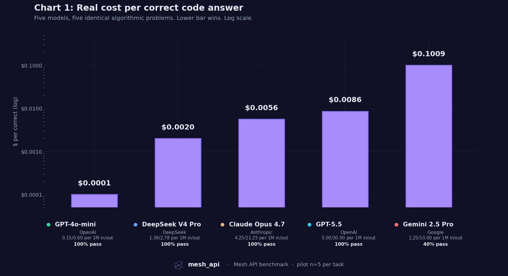
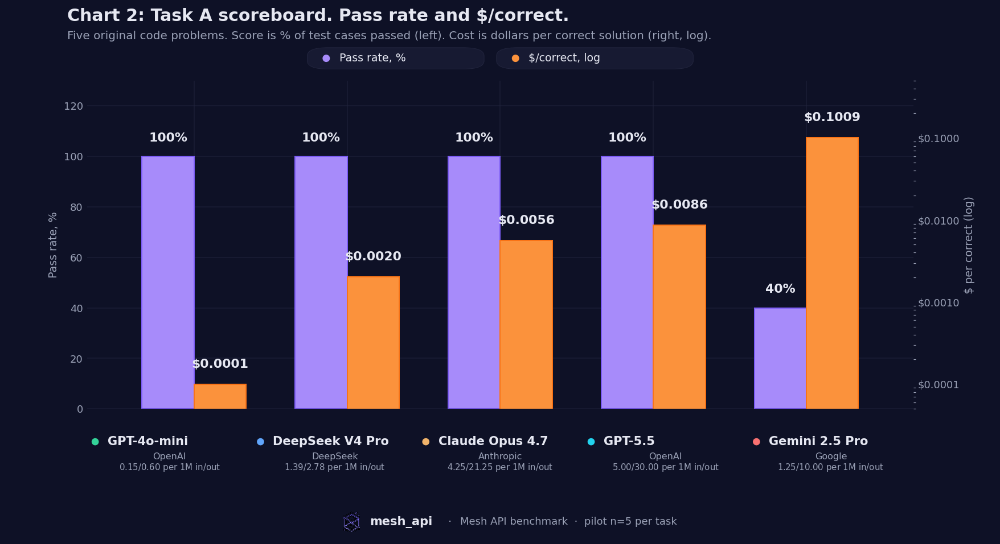
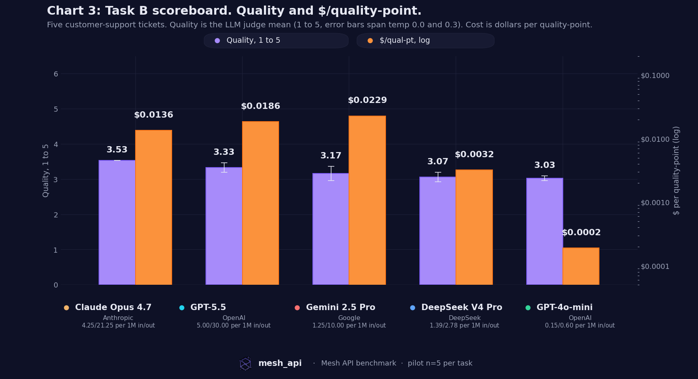
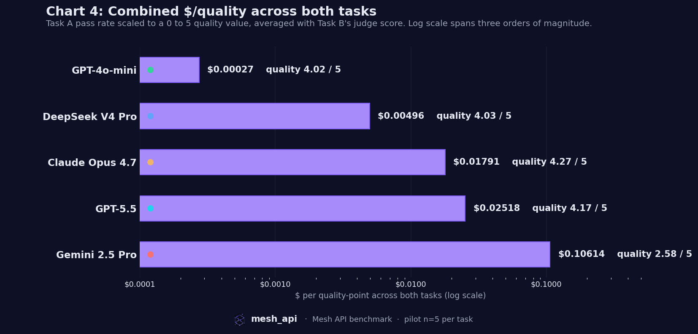

# A $0.15 model tied $30 models on code. Here's what we paid to find out.

*Five LLMs. Two tasks. Fifty calls. We measured what they actually cost, not what the price card says.*

---

**Heads up before you read further.**

What follows is what *we* found on *our* prompts on *one afternoon* in *one region* with *one model judge* and *five items per task*. Not the truth of the universe, just what the receipts said. Different prompts, different sample sizes, different judge models, different time-of-day, even different randomness on temperature 0.2 could shift the rankings.

The whole run is reproducible: the prompts, the runner, the judge, and the aggregator are in the repo. If you run them and get different numbers, that's a feature, please reply with what you saw. We'd rather get corrected in public than be wrong in silence.

This is a pilot (n=5/task). v1 with n=30 is coming. The headline gaps are big enough that the broad shape is unlikely to flip, but the second-decimal differences absolutely could.

---

## The four numbers

1. **Four of five models passed 100% of the code test.** GPT-4o-mini ($0.15/M in) and GPT-5.5 ($5/M in) both got 5/5. **Same answers, 86× the price.**

2. **Claude Opus 4.7's tokenizer billed us ~60% more input tokens than OpenAI's for the same English prompts.** A $5/M-input model is really charging ~$8/M-input on the text we sent. That hidden tax is not on Anthropic's price page.

3. **Gemini 2.5 Pro billed 19,165 "output tokens" across 5 code problems. Visible answer content: ~840 tokens.** That's **~96% hidden reasoning that Mesh strips before the response reaches you**, and the model still only got 2 of 5 problems right.

4. **On support, the best model (Opus 4.7) was 14% higher quality than the cheapest (GPT-4o-mini), and 72× more expensive per quality-point.** A small quality bump that costs a fortune.

The picture in one chart:

---

## What we ran

Two tasks. Same five models. Same prompts to all of them. Token counts straight from each provider's `usage` field, not estimated. Dollars at the prices Mesh actually billed us.

- **Task A, code generation.** 5 original algorithmic problems with hidden test cases. Pass/fail per test, programmatic, no LLM judge needed.
- **Task B, customer support.** 5 synthetic tickets for a fictional cloud-storage product, each with a rubric. Claude Opus 4.7 rates each reply on tone, accuracy, completeness (1–5 each, mean reported). Two passes per item (temp 0.0 and 0.3) so we have variance bars.

The exact datasets:
- `task_a_code.json`, 30 problems total, 5 used in this pilot.
- `task_b_support.json`, 30 tickets total, 5 used in this pilot.

Both are in the repo. Run them against any model you can route to.

| Model | Tier | List $/M (in / out) |
| --- | --- | --- |
| GPT-5.5 | Frontier | $5.00 / $30.00 |
| Claude Opus 4.7 | Frontier | $5.00 / $25.00 (Mesh 15% disc → $4.25 / $21.25) |
| DeepSeek V4 Pro | Mid | $1.39 / $2.78 |
| Gemini 2.5 Pro | Mid | $1.25 / $10.00 |
| GPT-4o-mini | Workhorse | $0.15 / $0.60 |

---

## The headline result

| Model | Task A pass | Task A $/correct | Task B quality (1–5) | Task B $/qual-pt |
| --- | --- | --- | --- | --- |
| **GPT-4o-mini** | **5/5** | **$0.0001** | 3.03 ± 0.07 | **$0.00019** |
| DeepSeek V4 Pro | 5/5 | $0.00201 | 3.07 ± 0.13 | $0.00322 |
| Claude Opus 4.7 | 5/5 | $0.00563 | **3.53 ± 0.00** | $0.01363 |
| GPT-5.5 | 5/5 | $0.00859 | 3.33 ± 0.13 | $0.01856 |
| Gemini 2.5 Pro | 2/5 | $0.10090 | 3.17 ± 0.20 | $0.02288 |

**Two stories in one table.**

*On code:* four of five models tied at perfect. The only differentiator was cost. The cheapest model came out **86× cheaper than GPT-5.5**, **56× cheaper than Opus 4.7**, and over **1,000× cheaper than Gemini 2.5 Pro** per correct answer.

*On support:* Opus wins quality at 3.53, but it's a 0.5-point lead on a 5-point scale, costing 72× more per quality-point. Whether that's worth it depends entirely on how expensive a single bad reply is for your product.

The judge replicated itself perfectly on Opus (variance 0.00) and was noisiest on Gemini (0.20). Nothing exceeded 0.2, so the quality scores hold up.

> Caveat we want named explicitly: five items is small. The frontier models likely pull ahead on accuracy as problems get longer and uglier, multi-file refactors, ambiguous specs, deep reasoning. **The right question isn't "which model is best." It's "for the work I'm actually shipping, what's the smallest model that hits my accuracy bar?"**

---

## Four hidden taxes the price card never mentions

A token isn't a token isn't a token. Below are four cost layers we directly observed in this run, none of them on anyone's pricing page.

### Tax 1. The tokenizer tax (we measured it on our actual prompts)

You'd assume "input tokens" is a property of your input. It isn't. It's a property of the tokenizer that turns your input into tokens, and **every provider uses a different one**.

Ten identical English prompts, sent to all five models. Here's the input-token count each provider reported:

| Model | Input tokens for the 10 prompts | Delta vs. OpenAI baseline |
| --- | --- | --- |
| GPT-4o-mini (OpenAI) | 1,544 | baseline |
| GPT-5.5 (OpenAI) | 1,534 | −0.6% |
| DeepSeek V4 Pro | 1,582 | +2.5% |
| Gemini 2.5 Pro | 1,637 | +6.0% |
| **Claude Opus 4.7** | **2,468** | **+59.8%** |

Same text. Same words. Opus's tokenizer cut English into ~60% more pieces, and we paid for every piece. Opus's effective input price on this corpus comes out closer to **$5 × 1.60 ≈ $8/M-in**, not the $5/M-in on the card.

> Your number will differ. Code-heavy traffic, multilingual, structured data, every workload tokenizes differently. The right thing to do: take 1,000 tokens of *your* actual traffic, send it through each provider with `max_tokens=1`, read `usage.prompt_tokens`, write down the ratio, plug it into your cost model. One hour of work, then your unit economics aren't lying to you anymore.

### Tax 2. The reasoning tax (paying for thoughts you never see)

Some models "think" silently before they answer. Those reasoning tokens are real tokens, on your bill, even though you can't see them in the response.

**Gemini 2.5 Pro is the worst case we measured:**

- Output tokens billed across 5 code problems: **19,165**
- Visible answer content total: ~3,400 characters, roughly **~840 tokens**
- **~96% of what we paid for never reached the response body.**

A single Gemini call on Task A cost ~$0.04. The equivalent GPT-4o-mini call cost ~$0.0001. **400× more expensive, and Gemini got 2 of 5 right vs. GPT-4o-mini's 5 of 5.**

GPT-5.5 also does internal reasoning, visibly less than Gemini, but it's there. Average output per Task A item: **226 tokens (GPT-5.5) vs. 137 (GPT-4o-mini)**. That's 65% more billed output for similar-length final answers.

> If your provider exposes a reasoning-effort knob, dial it to the lowest setting that hits your accuracy bar. "Thinking tokens" in marketing copy is "billed-but-invisible tokens" on your invoice.

### Tax 3. The accuracy assumption that didn't hold (at this size)

The intuitive model is: *frontier models cost more but get more right, so $/correct evens out.* In our run, **it didn't.** Four of five models, including the cheap one, hit 100% on the code test. The premium tiers didn't pull ahead on accuracy at all. They pulled ahead on dollars-per-correct-answer, in the wrong direction:

| Model | $/correct | Multiple vs. GPT-4o-mini |
| --- | --- | --- |
| GPT-4o-mini | $0.0001 | 1× |
| DeepSeek V4 Pro | $0.00201 | **20×** |
| Claude Opus 4.7 | $0.00563 | **56×** |
| GPT-5.5 | $0.00859 | **86×** |
| Gemini 2.5 Pro | $0.10090 | **1,009×** |

> Honest disclaimer: five problems is a small slice. On longer, gnarlier problems, multi-step planning, large codebases, deep reasoning, the frontier models very likely pull ahead on accuracy, and the math flips. **Take this as "the floor is lower than you think for common code," not "premium models are useless."** The takeaway is to know where your floor is, then route accordingly.

### Tax 4. Quality saturation (small wins, big bills)

On support, every model produced something workable. The quality range across all five was 3.03 to 3.53, a 0.5-point spread on a 5-point scale, or **14% relative**.

The **cost** range over the same five was **80×** ($0.0006 for GPT-4o-mini vs. $0.0482 for Opus 4.7, after applying our placeholder output-token inflation).

Opus 4.7 buys a small quality bump for a huge cost bump. That can be worth it on calls where a bad reply is expensive (security, finance, brand-attached customer copy). It's a bad trade on the routine 80% of support volume where any of the five would have produced something fine.

> The decision rule isn't "use the best model." It's **"route the call by what it actually needs."** Most companies skip that step and pay frontier prices for everything. The over-spend is structural, not accidental.

---

## Latency, while we're at it

Cost isn't the only axis. On the same calls:

| Model | Task A avg | Task B avg |
| --- | --- | --- |
| GPT-4o-mini | 2.4 s | 2.3 s |
| Claude Opus 4.7 | 3.9 s | 7.1 s |
| GPT-5.5 | 5.5 s | 9.2 s |
| Gemini 2.5 Pro | 28.0 s | 13.7 s |
| DeepSeek V4 Pro | **28.4 s** | 16.2 s |

DeepSeek V4 Pro looks like a steal on $/correct (2nd-best at $0.00201) but it took **~28 seconds** to produce each code answer on average. For an interactive product, that's unshippable. For an overnight batch job, it's a bargain. Match the model to the use case.

---

## The combined picture

When we average the two tasks (treating Task A's pass rate as a 0–5 quality score for direct comparison), the ladder is clean:

A three-order-of-magnitude gap between cheapest and most expensive, with roughly the same quality on either end. **The smartest model in the line-up costs 65× more per quality-point than the workhorse, for a 6% absolute quality improvement.** That's a routing problem, not a model-selection problem.

---

## Decision rules that fall out of this

For builders shipping production LLM features:

1. **Default to the workhorse tier.** A $0.15/M model handled 100% of our code problems and got within 86% of the top quality score on support. For most volume, that's plenty. Pay frontier prices for the calls where being wrong is unusually expensive, not for the calls where being right is unusually cheap.

2. **Measure your real tokenizer tax once, bake it into your cost model.** Don't trust the price card. Our Opus 1.60× input-side ratio is specific to *our* English-text benchmark; *your* number will differ. Spend an hour, get your real ratio, plug it in. Update quarterly.

3. **Watch for reasoning tokens.** Models that do invisible chain-of-thought can 5× or 50× your output bill without you seeing what you're paying for. If the provider exposes a reasoning-effort knob, pick the lowest setting that hits your accuracy bar. If not, monitor `usage.completion_tokens` against actual response length.

4. **Build a router, not a model choice.** Pick a cheap default, an expensive escalation path, a heuristic for when to escalate. That structure handles the price card lying *and* tokenizer drift *and* future model launches. Single-model architectures don't.

---

## Why we ran this through Mesh API

Every call in this benchmark went through Mesh (`api.meshapi.ai`). One client, one key, one bill, five providers behind it. Switching models was changing a string in a list. Without that, this whole post is a stack of SDKs, auth flows, rate-limit dialects, and per-vendor billing pages, and it would have taken a week, not an afternoon.

For production: same idea, plus the ability to route by prompt characteristic. Cheap default, frontier escalation, observability across all of it. That's the routing layer that lets Decision Rule #4 above actually become real code.

---

## What this benchmark deliberately does not tell you

In service of honesty, here's everything we *didn't* cover. Hold us to all of these:

- **n=5 per task.** Big enough to see headline gaps, way too small for confidence intervals or arguing second-decimal differences. The 5/5 ties on Task A could move by an item or two at n=30 (v1 lands shortly).
- **Single judge for Task B.** Claude Opus 4.7 rated every model's replies, including Anthropic's own model's replies. Risk of own-output bias is real. We mitigated by running each rating twice; v2 will use a three-judge ensemble and majority vote.
- **No human eval.** Quality scores are LLM-judged. A human calibration set is on the v2 list.
- **Task A scoring is binary.** A nearly-right solution that fails one edge case scores zero. Harsh, but consistent across models.
- **Pattern overlap with training data is likely.** Our exact prompts are original, but "longest increasing subarray" and "BFS on a grid" absolutely sit in every model's training distribution. We can't claim contamination-free.
- **Single region, single time-of-day, single run.** No confidence intervals; provider throttling shifts by hour.
- **No streaming, no time-to-first-token, no p95 latency.** Different post.
- **Output-token inflation factors are placeholder** (Opus 1.35×, GPT-5.5 1.20×, Gemini 1.05×). The **input-side** 60% Opus number is real and measured on this run's prompts. The output-side numbers need a controlled corpus to be properly measured; v2 will do that.
- **Five models. Your favorite isn't in here.** The scripts will run any Mesh-routable model, clone the repo, add a row, go.

> Everything above is a "what we didn't do." If you noticed a methodological hole we haven't named here, please reply, we'd rather fix it in v2 than ship it as a foundation.

---

## Methodology, briefly

- **Runner.** Every call: temperature 0.2, max_tokens 4096, identical prompt across models. Three retries with exponential backoff on transient errors. Token counts straight from provider `usage`. Mesh as the routing layer.
- **Task A judge.** Extract Python from fenced block, run in subprocess with 8-second timeout against hidden tests. All-or-nothing per test.
- **Task B judge.** Claude Opus 4.7, two passes per output (temp 0.0 and 0.3). Three integer scores 1–5 (tone, accuracy, completeness). Quality = mean of the six numbers per item. Variance = spread between the two temperature passes.
- **Effective cost formula.** `(in_tokens × in_price + out_tokens × out_price × inflation_factor) / 1M`. Input-side inflation came from real per-model token counts on identical prompts (table in Tax 1). Output-side inflation is the kit's placeholder values, to be replaced in v2.

---

## Reproduce it yourself

- Datasets: `task_a_code.json`, `task_b_support.json`, both in the repo, MIT-licensed.
- Scripts: `runner.py`, `judge.py`, `aggregate.py`, `cost_estimator.py`, drop in your Mesh key, point at any subset of the catalog, get a CSV that matches this post's tables.
- Total cost for the whole benchmark including discarded re-runs while we debugged: **about $1.30**. One Opus call is a quarter of a cent. A million of them adds up.

**Repo + raw CSVs + this post's tables: `<<link>>`**

---

*This is v1, pilot edition. v2 ships with n=30, three-judge ensemble, human calibration on 100 items, latency percentiles, and (probably) two more models in the lineup. If you want a ping when it's out, follow this account and we'll post a thread the morning it lands.*

*Caveats welcome. Numbers welcome more. If you run this against your own workload and get different results, reply with the CSV and we'll fold the corrections into v2.*
